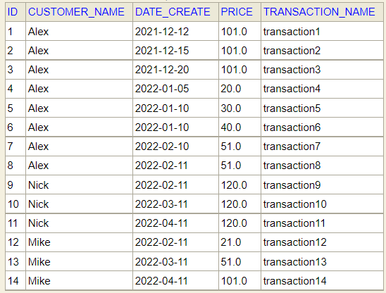

# Calculate the reward points
* [General info](#general-info)
* [Technologies](#technologies)
* [Installing](#installing)
* [Running test](#running-test)
* [Health check](#health-check)
* [Test data](#test-data)
* [Expected result](#expected-result)

## General info
Test task

## Technologies
- JDK11
- Spring Boot 2
- Maven 3
- Database - H2 (in memory)

## Installing
To clone and run this application, you'll need:
- Download project from github URL:

      git clone https://github.com/RomanukAlex/reward-points-service.git

- Go into the repository:

      cd reward-points-service

- Build project

      mvn clean package

- Run applications with H2 database (in memory): 

      mvn spring-boot:run

- Open 

      http://www.localhost:8099/v1/customers/reward-points-info?language=EN
      Languages: EN, ES, FR

## Running test
    mvn test

## Health check
    http://www.localhost:8099/actuator/health

## Test data

## Expected reward points result
Name | December | January | February | March | April| Total |
:---: | :---: | :---: | :---: | :---: | :---: | :---: |
Alex | 156 | 0 | 2 |   |   | 158 |
Mike |   |   | 0 | 1 | 52 | 53 |
Nick |   |   | 90 | 90 | 90 | 270 |
